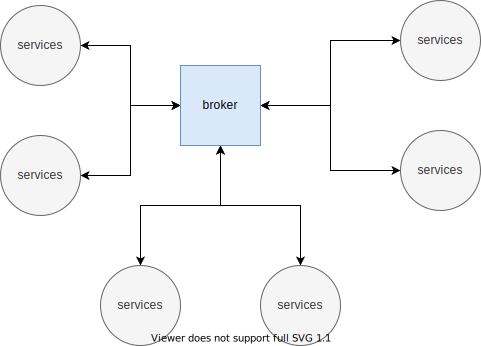
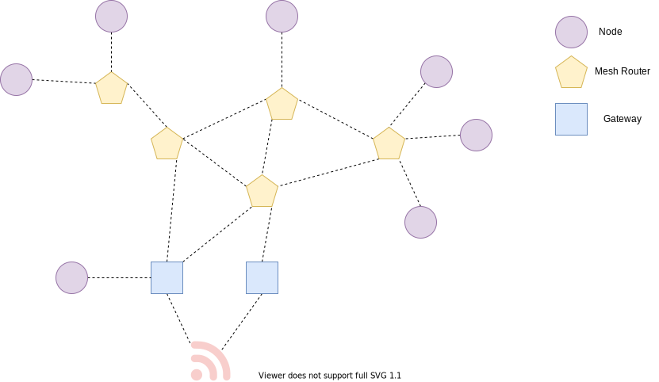

# Alinea

!!! warning
    Alinea is under ideation

> "Beginning of a new way of thinking" or _a linea_, refering to &para; new paragraph.

Alinea is trial to look into how to get an on-premise solution for data gathering / collection from devices in an industiral setting. A common way these days are to use some kind of brokered message passing where we have a centralized queueing system. Alltough in the industry what we see more of is communication by use of a mesh nettwork. In a microservice type of architecture message passing is a common way to communicate and in many cases this is done by use of [`RabbitMQ`](https://www.rabbitmq.com/), [`NATS`](https://nats.io/) or other brokered services. A brokered communication is based on as seen in figure 1 and a mesh type of communication as seen in figure2.

In Alinea we will look into and reasearch the use of meshed nettworking and how we could rather incoperate that in the microservice architecture. So what we will start looking into with the use of a mesh nettwork are:

- **Discovery** how do we learn about other nodes on the network.
- **Presence** how do we track when other nodes come and go.
- **Connectivity** how do we actually connect one node to another
- **Point-to-point messaging** how do we send a message from one node to another.
- **Group messaging** how do we send a message from one node to a group of others.
- **Distributed Logging** how do we track what this cloud of nodes is doing so we can detect performance problems and failures.
- **Content distribution** how do we send content from one node to another.

> Figure1: Brokered communication where all communication goes thrue a centralized system.

> Figure2: Mesh based nettworking where where we can see we got 3 diffrent `devices` or `sevices` creating the mesh nettwork.
## License MIT

Copyright (c) 2021-2021 Idar Bergli

Permission is hereby granted, free of charge, to any person obtaining
a copy of this software and associated documentation files (the
"Software"), to deal in the Software without restriction, including
without limitation the rights to use, copy, modify, merge, publish,
distribute, sublicense, and/or sell copies of the Software, and to
permit persons to whom the Software is furnished to do so, subject to
the following conditions:

The above copyright notice and this permission notice shall be
included in all copies or substantial portions of the Software.

THE SOFTWARE IS PROVIDED "AS IS", WITHOUT WARRANTY OF ANY KIND,
EXPRESS OR IMPLIED, INCLUDING BUT NOT LIMITED TO THE WARRANTIES OF
MERCHANTABILITY, FITNESS FOR A PARTICULAR PURPOSE AND
NONINFRINGEMENT. IN NO EVENT SHALL THE AUTHORS OR COPYRIGHT HOLDERS BE
LIABLE FOR ANY CLAIM, DAMAGES OR OTHER LIABILITY, WHETHER IN AN ACTION
OF CONTRACT, TORT OR OTHERWISE, ARISING FROM, OUT OF OR IN CONNECTION
WITH THE SOFTWARE OR THE USE OR OTHER DEALINGS IN THE SOFTWARE.
