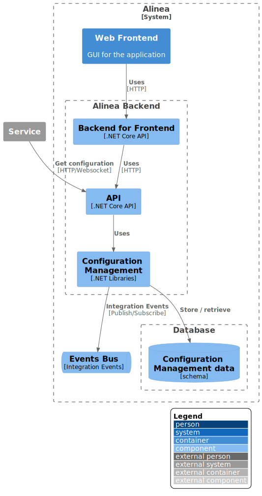

!!! info
    The [PlantUML](https://plantuml.com/) (diagram as text) component was used to describe all C4 model levels. Additionally,
    for levels C1-C3, a [C4-PlantUML](https://github.com/plantuml-stdlib/C4-PlantUML) plug-in connecting PlantUML with the C4 model is used.

## C1 System Context

## C2 Container

## C3 Component

## C4 Code

TBD
