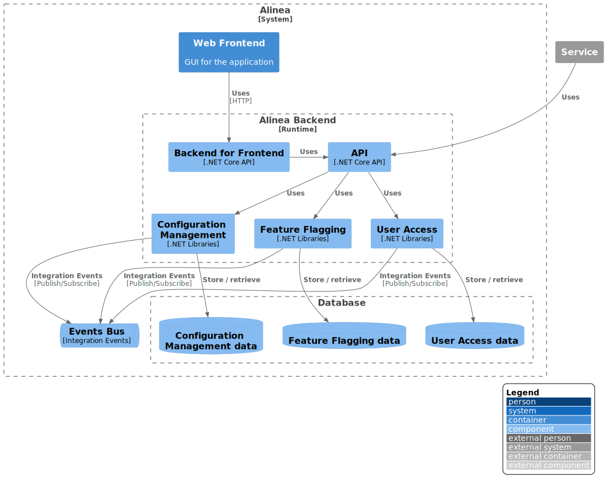

Different services created for Alinea is described and document in this section and they will contain at least the following:

- **Domain**: Domain description with event storming diagrams
- **Architecture**: Architecture diagrams following the [C4 model](https://c4model.com/) which 
is a lean graphical notation technique for modelling the architecture of software systems.

> As can be found on the website of the author of this model ([Simon Brown](https://simonbrown.je/)): The C4 model was created as a way
> to help software development teams describe and communicate software architecture, both during up-front design sessions and when retrospectively documenting an existing codebase.

> Model C4 defines 4 levels (views) of the system architecture: System Context, Container, Component and Code.

## C3 Component Model of Alinea

